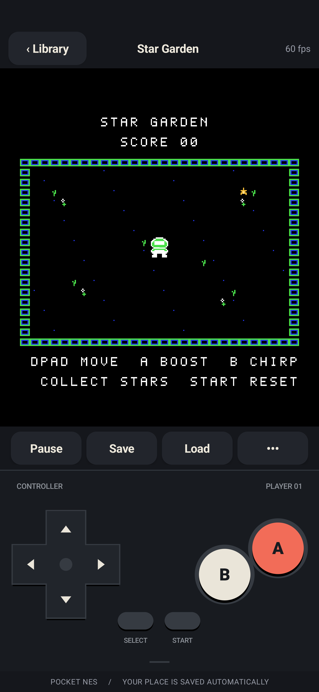

# Pocket NES

A native Android NES emulator with crisp pixels, multitouch controls, and a library that travels with you. Built in Java and C++, using the real [FCEUmm emulation core](https://github.com/libretro/libretro-fceumm).

An original playable cartridge, **Star Garden**, is included. Open the app and tap its cartridge to start playing immediately.



[Landscape layout](docs/images/landscape.png)

## Download

Download the newest APK from the [releases page](https://github.com/culpen90/nes/releases), which includes beta and stable versions. Every automatic release includes a signed production APK with its own embedded version and checksums, for Android 8.0 or later on `arm64-v8a` and `x86_64` devices.

The historical first beta, **1.0.0-beta.1**, remains available:

- [First beta release](https://github.com/culpen90/nes/releases/tag/v1.0.0-beta.1)
- [First beta signed production APK](https://github.com/culpen90/nes/releases/download/v1.0.0-beta.1/pocket-nes-1.0.0-beta.1.apk)
- [First beta SHA-256 checksums](https://github.com/culpen90/nes/releases/download/v1.0.0-beta.1/SHA256SUMS)

See [release and signing instructions](docs/releases.md) for production builds, checksum verification, and updates.

## Features

- Import iNES / NES 2.0 `.nes` cartridges or a ZIP containing one game.
- Multitouch D-pad, diagonal movement, A/B, Select, and Start.
- Android gamepad and keyboard event handling is implemented; external accessory hardware is currently unverified.
- Sharp, aspect-correct video in portrait and landscape, with stereo audio.
- Pause, restart, mute, and a quick-save slot for each cartridge.
- Automatic resume and cartridge battery saves.
- Offline play with private on-device storage; no network or broad storage permission.

## Start playing

1. Install the APK and open **Pocket NES**.
2. Tap **Star Garden** to try the included demo, or **Import a game** to pick a cartridge.
3. Tap a cartridge in your library. Rotate the phone to switch layouts.
4. Use **Save** and **Load** for your quick-save slot. Returning to the library or switching apps saves your place automatically.

Imports are copied into app storage, so the original file can be moved afterward. ROM files and total expanded ZIP contents are limited to 32 MiB. ZIPs with multiple games are rejected. Duplicate cartridges share an entry and saves, identified by their SHA-256 hash.

### Controls

| NES input | Touch | Gamepad | Keyboard |
| --- | --- | --- | --- |
| Move | D-pad | D-pad or left stick | Arrow keys |
| A | A | A or Y | X |
| B | B | B or X | Z |
| Start | START | Start | Enter |
| Select | SELECT | Select | Left/right Shift |

Touch controls are the required first-stable input path. The gamepad and
keyboard columns describe implemented mappings; external gamepads, controllers,
mice, and hardware keyboards are optional test coverage and their absence does
not block stable promotion. No mouse support is claimed.

In **Star Garden**, collect gold stars with the astronaut. Hold **A** to move faster, press **B** for a tone, and press **Start** to reset. See [the demo notes](docs/demo.md) for its source and design. The **•••** menu offers sound, cartridge restart, and controller help.

## Build

Requirements:

- JDK 17–23; the project was built with JDK 21.
- Android SDK platform **36**, Build Tools **35.0.0**, NDK **28.2.13676358**, CMake **3.22.1**.
- Android 8.0 / API 26 or later to run the app. The APK includes `arm64-v8a` and `x86_64` libraries.

The wrapper provides Gradle **8.13**; Android Gradle Plugin **8.13.2** is pinned. Complete core source is vendored, with no Git submodule or prebuilt core download required.

Open the project in Android Studio and install the required SDK components, or use the command-line SDK tools:

```sh
sdkmanager 'platforms;android-36' 'build-tools;35.0.0' 'ndk;28.2.13676358' 'cmake;3.22.1'
```

Set `JAVA_HOME` to a supported JDK. Set `ANDROID_HOME` to your SDK directory, or create an untracked `local.properties` containing `sdk.dir=/absolute/path/to/Android/sdk`.

```sh
./gradlew assembleDebug
```

APK output: `app/build/outputs/apk/debug/app-debug.apk`.

### Production release

The release variant uses a private signing key, R8 optimization, and resource shrinking. Configure your own signing key outside the repository, then run:

```sh
./tools/build-release.sh
```

The first beta uses `versionName` **1.0.0-beta.1** and `versionCode` **1**. Automated builds inject each release's version name and increasing version code, verify the APK's embedded values and official certificate, and publish the signed APK, checksums, and build provenance. See [release builds](docs/releases.md) for signing configuration and output files. Android updates require the same signing key and an increased version code.

### Automatic release versions

Merged pull requests targeting `main` automatically release **1.0.0-beta.N** until a merged PR includes the exact standalone body line `[release:stable]`. That requests the first stable **1.0.0**; subsequent releases are stable. Any contributor, including fork contributors, can propose the marker. Maintainers MUST verify the [mandatory first-stable criteria](CONTRIBUTING.md#mandatory-first-stable-acceptance-policy) before merging it; the bot does not assess those criteria.

After promotion, `feat:` titles bump the minor version, Conventional Commit breaking-change titles or a `BREAKING CHANGE:` body line bump the major version, and other merged PRs bump the patch version. A standalone `[release:major]`, `[release:minor]`, or `[release:patch]` body line can override the inferred stable bump. See the [automatic release guide](docs/releases.md#automatic-releases) for the full marker rules, trusted signing setup, and recovery.

### Wireless debugging

Enable **Developer options → Wireless debugging** on the phone, then use the addresses and pairing code displayed there:

```sh
adb pair PHONE_IP:PAIRING_PORT
adb connect PHONE_IP:DEBUGGING_PORT
adb devices -l
```

Pairing and debugging use different ports. If the phone already appears with status `device`, build, install, and open the app with:

```sh
./tools/run-on-phone.sh
```

For multiple attached devices, pass the desired ADB serial as the script's first argument. On macOS, the script detects the usual SDK location and Homebrew JDK 21 when those environment variables are unset.

Manual installation:

```sh
adb install -r app/build/outputs/apk/debug/app-debug.apk
adb shell am start -n com.culpen.nes/.MainActivity
```

## Validation

Built and run on a wirelessly connected Samsung **SM-S938U**, Android API **37**, on **2026-10-08**. The included demo runs at approximately **60 fps** on that device. Functional tests against real FCEUmm cover movement, boost, star collection and score, audio, boundaries, reset, and save/restore.

**Verified:** Android lint passes; all **7 device tests** pass; native regression checks pass for battery RAM persistence, cartridge validation, corrupt/wrong-cartridge states, and reloads. Manual phone checks cover file-picker import, quick save/load, and rotation while paused. Physical Bluetooth/USB controller hardware was not available for testing; its standard Android input handling is implemented.

Build the dependency-free device test APK and run Android lint:

```sh
./gradlew lintDebug assembleDebug assembleDebugAndroidTest
adb install -r app/build/outputs/apk/debug/app-debug.apk
adb install -r app/build/outputs/apk/androidTest/debug/app-debug-androidTest.apk
adb shell am force-stop com.culpen.nes
adb shell am instrument -w com.culpen.nes.test/com.culpen.nes.EmulatorInstrumentation
```

Instrumentation uses a separate cartridge copy and does not launch the app Activity. Reopen the app after tests finish.

Native smoke test, with CMake and a C/C++ compiler:

```sh
cmake -S app/src/main/cpp -B build/native -DCMAKE_BUILD_TYPE=Release
cmake --build build/native --parallel
ctest --test-dir build/native --output-on-failure
build/native/nescore_smoke app/src/main/assets/demo.nes
```

Regenerate the original cartridge with `python3 tools/generate_demo.py`. [tests/demo_smoke.py](tests/demo_smoke.py) accepts a built FCEUmm libretro shared library and checks actual CPU RAM, video, sound, input, and state restoration.

## Project layout

| Path | Purpose |
| --- | --- |
| `app/src/main/java/com/culpen/nes/` | Library, Android UI, emulation thread, audio, touch and hardware input |
| `app/src/main/cpp/` | Native frontend, JNI bridge, CMake, native smoke runner |
| `app/src/main/assets/` | Original Star Garden cartridge and GPL license |
| `app/src/androidTest/` | Native and touch-control device tests |
| `third_party/fceumm/` | Pinned FCEUmm source and upstream notices |
| `tools/` | Demo generator, phone build/install helper, and signed release builder |
| `tests/` | Original cartridge functional tests |

## Saves and current scope

Private app storage contains `files/roms` and `files/saves`. Each cartridge has an automatic resume state (`.auto`), a manual quick save (`.state`), and battery RAM (`.sav`) when the cartridge supports it. Battery RAM is persisted during play and when leaving or backgrounding the game. Uninstalling the app or clearing its data removes the library and saves. Cloud sync and save export are not implemented.

This version provides one-player cartridge emulation. FDS disk images, second-player input, cheats, rewind, and controller remapping are outside the app interface. Mapper compatibility depends on the pinned FCEUmm core; testing the demo does not establish compatibility with every NES game.

Save states restore gameplay and video. Upstream FCEUmm does not serialize its high-quality audio resampler phase, so restored PCM is not guaranteed to be sample-identical. Details and JNI contracts are in the [native frontend notes](app/src/main/cpp/README.md).

## Contributing

For setup, testing, and pull request guidance, see [Contributing](CONTRIBUTING.md).

## License and credits

Pocket NES and its native frontend are licensed under **GNU GPL version 2 or later**; see [COPYING](COPYING). FCEUmm is pinned at commit `7a542dab1e87679921962a9f056186eca425c0c2`, with upstream copyright and license notices preserved. See [third-party provenance](third_party/README.md).

Star Garden's original code and artwork are dedicated to the public domain under **CC0**, as described in [docs/demo.md](docs/demo.md). No commercial game ROMs are included.

NES and Nintendo are trademarks of Nintendo. Pocket NES is an independent project.
